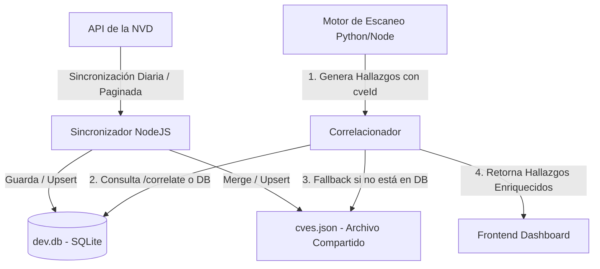

# Documentación de Arquitectura — Catálogo y Correlación de Vulnerabilidades CVE (HU-005)

Esta sección detalla cómo el catálogo de CVEs obtenido diariamente desde la API de la NVD se integra y conecta con el motor de escaneo (incluyendo el backend en NodeJS y el escáner asíncrono en Python de `atrox/`).

---

## 1. Visión General del Diseño

El objetivo principal es disponer de un catálogo actualizado localmente de CVEs para enriquecer los hallazgos de vulnerabilidades en tiempo real. 

Se definen tres mecanismos para el consumo y correlación de este catálogo, asegurando flexibilidad para componentes distribuidos en Node o Python:
1. **API REST de Correlación Masiva (Recomendado)**: Un endpoint HTTP interno en Node donde el escáner envía su lote de hallazgos y recibe de vuelta el lote enriquecido con metadatos de severidad y CVSS.
2. **Acceso Directo a Base de Datos (DB Compartida)**: El catálogo reside en la tabla `Cve` dentro de `dev.db` (SQLite). Cualquier proceso con acceso de lectura a la base de datos local puede consultar directamente la tabla.
3. **Catálogo de Archivo Compartido (`cves.json`)**: Un archivo JSON estructurado que actúa como respaldo o caché de compatibilidad histórica, útil si se ejecutan componentes en contenedores aislados que monten un volumen común.



---

## 2. Contratos de Integración y Endpoints de API

### A. Endpoint de Consulta Individual
Permite obtener la descripción y severidad de un CVE específico.

- **Ruta**: `GET /api/cves/:cveId`
- **Ejemplo de Petición**: `/api/cves/CVE-2019-1010001`
- **Respuesta Exitosa (`200 OK`)**:
  ```json
  {
    "cveId": "CVE-2019-1010001",
    "cvss": 8.8,
    "description": "El error en la librería...",
    "published": "2019-07-15T15:15:11.727",
    "modified": "2023-11-07T03:02:11.873",
    "createdAt": "2026-07-15T23:00:00.000Z",
    "updatedAt": "2026-07-15T23:00:00.000Z"
  }
  ```
- **Respuesta no Encontrado (`404 Not Found`)**:
  ```json
  {
    "error": "CVE CVE-2019-1010001 no encontrado en el catálogo."
  }
  ```

### B. Endpoint de Correlación Masiva
Recibe un arreglo de hallazgos crudos y los devuelve decorados con la metadata del catálogo CVE.

- **Ruta**: `POST /api/cves/correlate`
- **Cuerpo de Petición (`Content-Type: application/json`)**:
  ```json
  {
    "findings": [
      {
        "id": "finding-uuid-1",
        "cveId": "CVE-2019-1010001",
        "severity": "unknown",
        "description": "Detected library issue"
      },
      {
        "id": "finding-uuid-2",
        "cveId": "CVE-invalid-nonexistent",
        "severity": "high",
        "description": "Custom scan finding"
      }
    ]
  }
  ```
- **Respuesta Exitosa (`200 OK`)**:
  ```json
  {
    "findings": [
      {
        "id": "finding-uuid-1",
        "cveId": "CVE-2019-1010001",
        "severity": "unknown",
        "description": "Detected library issue",
        "cvss": 8.8,
        "published": "2019-07-15T15:15:11.727",
        "modified": "2023-11-07T03:02:11.873",
        "correlated": true
      },
      {
        "id": "finding-uuid-2",
        "cveId": "CVE-invalid-nonexistent",
        "severity": "high",
        "description": "Custom scan finding",
        "correlated": false
      }
    ]
  }
  ```

---

## 3. Lógica del Correlacionador en el Motor de Escaneo (Python)

Cuando el módulo de escaneo de Python (e.g. Nuclei o Nmap) finaliza su ejecución, realiza las siguientes tareas para enriquecer sus reportes:

1. **Agrupamiento**: Filtra los hallazgos que contengan el identificador `cveId` y descarta duplicados.
2. **Petición HTTP**: Llama asíncronamente al endpoint local `/api/cves/correlate`.
3. **Fallback Local**: Si el endpoint web falla (por caída de red temporal), el motor de Python lee y parsea localmente el archivo estructurado `src/Backend/data/cves.json` para realizar la correlación directa en memoria.
4. **Actualización de severidad**: Modifica la severidad interna del hallazgo basada en el `cvss` (e.g., CVSS $\ge$ 9.0 $\rightarrow$ Crítica, 7.0-8.9 $\rightarrow$ Alta, etc.) garantizando que coincida con los estándares oficiales de la NVD.
