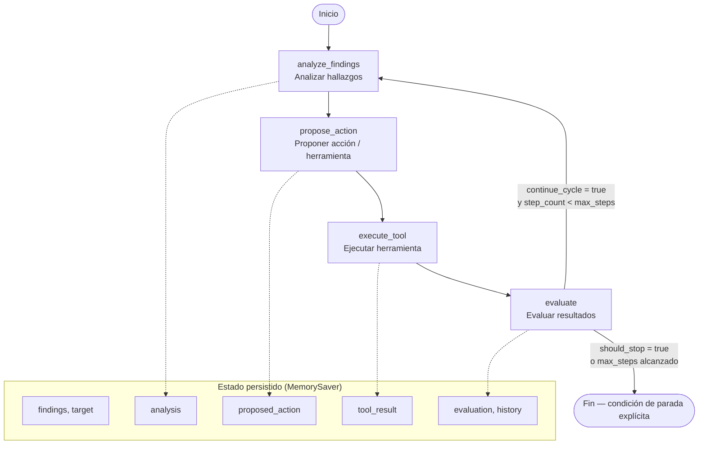

# Flujo del Orquestador de Pentesting — LangGraph (HU-013)

**Trazabilidad:** RF-003 · ADR-002  
**Módulo:** `src/Backend/atrox/ai/graph/`

---

## Diagrama de flujo



---

## Nodos del grafo

| Nodo | Responsabilidad | Salida en estado |
| :--- | :--- | :--- |
| **analyze_findings** | Correlaciona hallazgos de escaneos previos | `analysis` |
| **propose_action** | Decide la siguiente herramienta (Nmap, Nuclei, etc.) | `proposed_action` |
| **execute_tool** | Ejecuta (o simula) la herramienta propuesta | `tool_result`, `executed_tools` |
| **evaluate** | Determina si hay datos suficientes o se continúa el ciclo | `evaluation`, `should_stop` |

---

## Condiciones de parada explícitas

El ciclo termina cuando **cualquiera** de estas condiciones se cumple:

1. **`should_stop = true`** — el evaluador (`PentestDecider`) indica `continue_cycle: false`.
2. **`step_count >= max_steps`** — límite de seguridad configurable (default: 5).
3. **Herramienta propuesta = `none`** — no hay más acciones en el flujo heurístico.

Al detenerse, el estado incluye `stop_reason` con la justificación.

---

## Persistencia entre transiciones

- LangGraph **`MemorySaver`** actúa como checkpointer.
- Cada sesión se identifica con `thread_id`.
- El estado completo sobrevive entre transiciones del grafo y puede recuperarse vía `get_persisted_state(thread_id)`.

---

## Uso programático

```python
from atrox.ai.graph import run_pentest_orchestrator, MockDecider

findings = [
    {"id": "VULN-001", "severity": "critical", "name": "SQL Injection"},
    {"id": "VULN-002", "severity": "high", "name": "Outdated Apache"},
]

result = run_pentest_orchestrator(
    findings=findings,
    target="lab.target.local",
    thread_id="session-demo-001",
    max_steps=5,
    decider=MockDecider(stop_after_cycles=1),
)

print(result["stop_reason"])
print(result["executed_tools"])
print(result["history"])
```

---

## Integración futura con LLM (ADR-002)

El contrato `PentestDecider` permite sustituir `MockDecider` / `HeuristicDecider` por un decider basado en LangChain + Gemini/OpenAI/Ollama sin modificar el grafo.

```
HeuristicDecider / MockDecider  →  tests y laboratorio
LLMDecider (futuro HU-012+)     →  producción con API Cloud/Local
```

---

## Referencias

- [ADR-002](../../../docs/ADR/ADR-002%20Estrategia_Integracion_IA.md)
- [LangGraph docs](https://langchain-ai.github.io/langgraph/)
